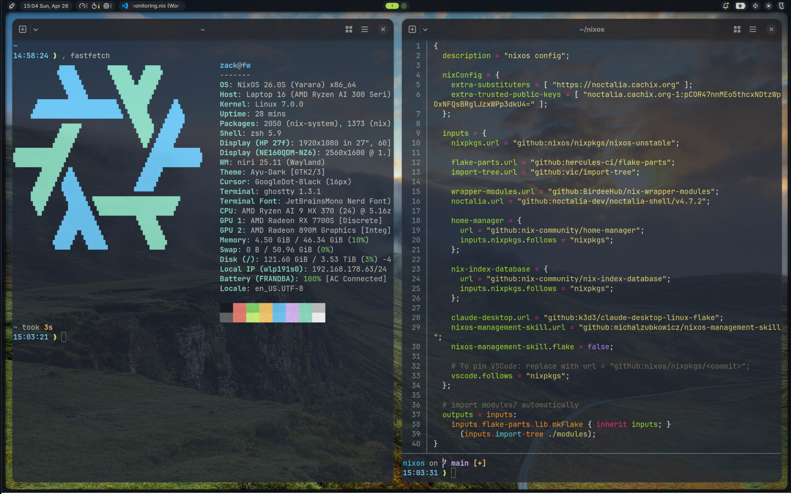
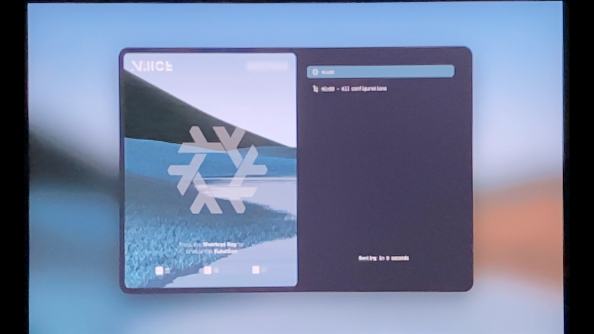

# nixos

Personal NixOS flake configuration for two hosts: a Framework laptop and a Hetzner VPS.

## Screenshots



| greeter | boot | splash |
|---------|-------------|-----------------|
|  |  |  |

## Hosts

| Host | Machine | User | Purpose |
|------|---------|------|---------|
| `framework` | Framework laptop | `zack` | Daily driver — Wayland (niri) + noctalia shell |
| `quote-assistant` | Hetzner VPS | `admin` / `app` | Nginx reverse proxy in front of a Clojure web app |

## Rebuild

```bash
# From /home/zack/nixos
sudo nixos-rebuild switch --flake .#framework
sudo nixos-rebuild switch --flake .#quote-assistant
```

> **Important:** any new `.nix` file must be staged (`git add`) before rebuilding. `import-tree` uses git to enumerate files — unstaged files are invisible to Nix.

## Architecture

All `.nix` files under `modules/` are auto-imported via [`import-tree`](https://github.com/vic/import-tree). There is no manual module registration.

```
modules/
  parts.nix                      # systems + pkgs (allowUnfree = true)
  hosts/
    framework/                   # nixosConfigurations.framework
    hetzner/quote-assistant/     # nixosConfigurations.quote-assistant
  home/
    common/config/               # shared defaults exported as flake.lib.*
    zack/                        # user modules + per-tool overrides
    vps/                         # VPS admin + app user modules
  module/<category>/
    <category>.nix               # root: options + imports all tools
    packages/<tool>.nix          # tool sub-module gated on its enable option
  peripherals/                   # keyboard, monitors, NAS, printer
```

### Key inputs

| Input | Purpose |
|-------|---------|
| `nixpkgs` | nixos-unstable |
| `flake-parts` | Structures flake outputs |
| `import-tree` | Auto-discovers `modules/**/*.nix` |
| `home-manager` | Integrated (follows nixpkgs) |
| `noctalia` | Desktop shell (pinned v4.7.2) |
| `wrapper-modules` | Wraps niri with custom settings |
| `claude-desktop` | Claude Desktop Linux build |
| `vscode` | Follows nixpkgs by default; pin by changing URL |

### Binary caches

| Cache | Where configured |
|-------|-----------------|
| `noctalia.cachix.org` | `flake.nix` nixConfig |
| `cache.nixos.org` | `configuration.nix` nix.settings |
| `devenv.cachix.org` | `configuration.nix` nix.settings |

## Module system

Options live under `config.<category>.programs.<tool>.enable`. Enable them in `modules/home/zack/home.nix`.

| Category | Tools |
|----------|-------|
| `ai` | claude-code, claude-desktop, codex, whisper-cpp |
| `backup` | restic |
| `browser` | chrome, chromium, firefox |
| `containers` | docker, podman, podman-desktop |
| `data` | jq, yq |
| `development` | git, gh, lazygit, direnv, devenv, delta |
| `development.languages` | python, clojure, nodejs, jdk |
| `development.language-tools` | uv, clj-kondo |
| `editor` | vscode, vim, neovim, emacs |
| `files` | fd, ripgrep, yazi, mc |
| `media` | asciinema, auto-editor, ffmpeg, discord, kdenlive, obs-studio, pear-desktop |
| `monitoring` | btop, bandwhich, gping |
| `passwords` | keepassxc |
| `productivity` | libreoffice, onlyoffice, wpsoffice |
| `shell-cli` | zsh, fish, nushell |
| `shell-tools` | atuin, atuin-desktop, fzf, zoxide, navi, tldr, starship, comma |
| `terminal` | tmux, ghostty |
| `theming` | bat, cursor, gtk |
| `compositor` | nixosModule — `compositor.type = "niri"` |
| `shell-desktop` | nixosModule — `shell-desktop.type = "noctalia"` |

### Common defaults

Shared settings are exported as `flake.lib.*` from `modules/home/common/config/`:

- `self.lib.monitors` — connector names for HP external (`DP-1`) and built-in (`eDP-2`)
- `self.lib.theme` — Nord color palette, opacity, and derived values
- `self.lib.noctalia.commonSettings` — 400+ line noctalia defaults

User configs overlay them with `lib.recursiveUpdate`.

## Adding a new program

1. Create `modules/module/<category>/packages/<tool>.nix` — gate config with `lib.mkIf config.<category>.programs.<tool>.enable`
2. Add `self.homeModules.<tool>` to imports in the category root module
3. Add `<tool>.enable = lib.mkEnableOption "..."` to the root module's options
4. Enable in `modules/home/zack/home.nix`
5. If user config needed: create `modules/home/zack/config/<tool>.nix` and import it in `home.nix`
6. `git add` every new file
7. Rebuild

## Running unavailable tools

Prefix any command with `,` to run a nixpkg on the fly without installing it:

```bash
, alejandra .
, nix-tree
```
